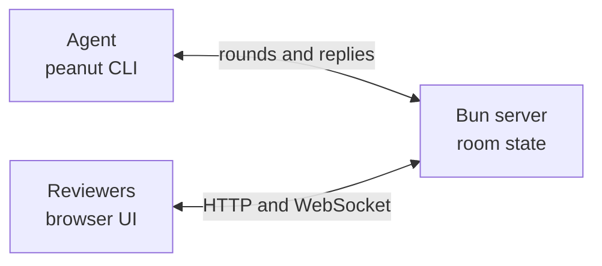

# Peanut

Peanut is a local, browser-based, multiplayer review surface for coding
agents. An agent shares a plan or a live UI. People join by link, pin
instructions to the content, and the agent applies them in rounds.

## How it works

1. An agent shares a Markdown file or live UI.
2. Reviewers join by link, pin instructions, and see live cursors.
3. The host sends the review round to the agent.
4. The agent applies the work and replies into the room.
5. The group repeats the loop until the host ends the review.

An annotation is an instruction to the agent. There is no comment type.

## Quick start

Download the Linux binary from the
[latest release](https://github.com/nethum529/peanut/releases/latest), then:

```sh
chmod +x peanut
./peanut share plan.md
```

Add `--tunnel` to create a public link with Cloudflare Quick Tunnels.

## Architecture



## Parts

- `packages/server`: rooms, WebSocket relay, and rounds API with long-poll.
- `packages/web`: review UI, live presence, and anchored instructions.
- `packages/cli`: the `peanut` command. It blocks until the review ends.
- `packages/adapters`: thin skill and command definitions per harness.

## Development

Requires [Bun](https://bun.sh).

```
bun install
bun test
```

Build the single binary with:

```
bun run build
```

The result is `dist/peanut`, a standalone executable with the web
assets embedded. Distribution is by GitHub releases only. Never
published to npm.

## License

MIT. Commits require a DCO `Signed-off-by` line.
